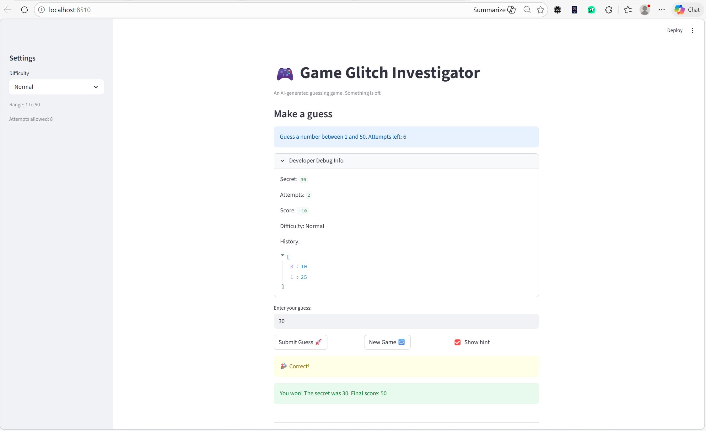
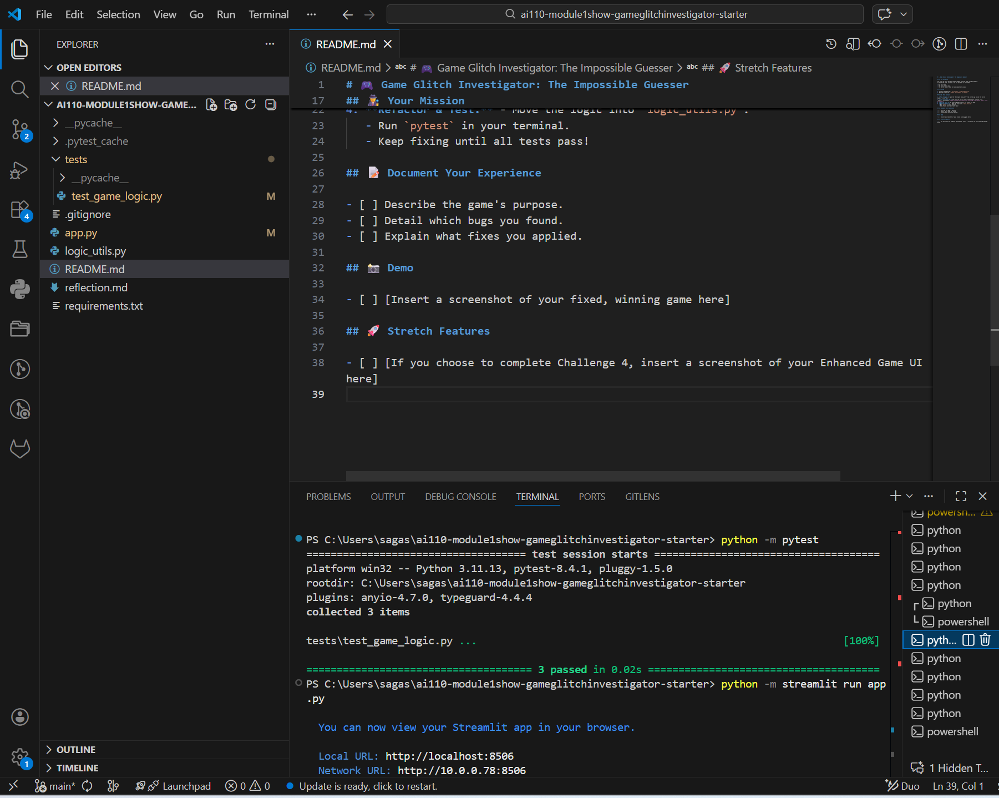

# 🎮 Game Glitch Investigator: The Impossible Guesser

## 🚨 The Situation

You asked an AI to build a simple "Number Guessing Game" using Streamlit.
It wrote the code, ran away, and now the game is unplayable. 

- You can't win.
- The hints lie to you.
- The secret number seems to have commitment issues.

## 🛠️ Setup

1. Install dependencies: `pip install -r requirements.txt`
2. Run the broken app: `python -m streamlit run app.py`

## 🕵️‍♂️ Your Mission

1. **Play the game.** Open the "Developer Debug Info" tab in the app to see the secret number. Try to win.
2. **Find the State Bug.** Why does the secret number change every time you click "Submit"? Ask ChatGPT: *"How do I keep a variable from resetting in Streamlit when I click a button?"*
3. **Fix the Logic.** The hints ("Higher/Lower") are wrong. Fix them.
4. **Refactor & Test.** - Move the logic into `logic_utils.py`.
   - Run `pytest` in your terminal.
   - Keep fixing until all tests pass!

## 📝 Document Your Experience

- [ ] Describe the game's purpose.\
The application is a number guessing game built with Streamlit.\
The game generates a secret number.\
The player must guess the number within a limited number of attempts.\
After each guess the game provides hints:\
   -Too High → Go LOWER\
   -Too Low → Go HIGHER\
The game tracks attempts and calculates a score.\

- [ ] Detail which bugs you found.
### Bugs Found
While testing the game, I discovered several issues:
1. **Incorrect Hint Logic**
   The hints for guesses were reversed. When the guess was higher than the secret number, the game sometimes suggested going higher instead of lower. I fixed this in the `check_guess` function.
2. **Input Field Did Not Reset**
   After submitting a guess, the text input box kept the previous value instead of clearing. I fixed this by updating the Streamlit input handling so the textbox resets after each submission.
3. **Difficulty level not fully applied** 
   Changing the difficulty level did not fully affect the game, and the displayed guessing range appeared unchanged.
4. **New Game did not reset the game state properly** 
   Clicking **New Game** changed the secret number but some information from the previous round remained.
5. **Incorrect difficulty ranges** 
   The number ranges assigned to difficulty levels were inconsistent.

- [ ] Explain what fixes you applied.
## 🔧 Fixes Applied
Several improvements were made to repair the game:
- **Refactored the core logic functions** into `logic_utils.py` to separate game logic from the Streamlit UI.
- **Fixed the high/low hint logic** so the game correctly tells the player when to guess higher or lower.
- **Corrected difficulty range handling** so the selected difficulty properly affects the guessing range.
- **Reset the input field after each guess** to improve the user experience.
- **Improved game state handling** so the secret number and game progress remain consistent during gameplay.
- **Added pytest tests** to verify the guessing logic and confirm the fixes work correctly.

## 📸 Demo

- [ ] [Insert a screenshot of your fixed, winning game here]

## 🚀 Stretch Features

- [ ] [If you choose to complete Challenge 4, insert a screenshot of your Enhanced Game UI here]
